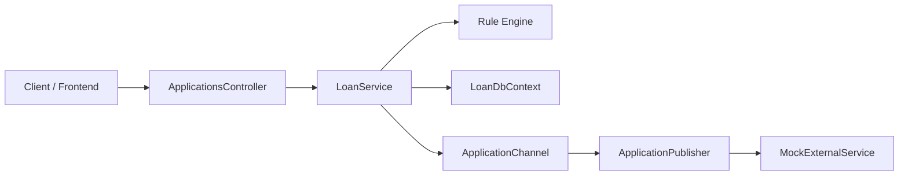

# Architecture Overview

## High-level flow

## Components

### Frontend structure

The web client now lives directly under `FrontEnd` as the application root. The previous nested `FrontEnd/loan-app-frontend` path was removed, so the frontend files are organized under a single folder for the Next.js app.

### 1. API layer

The ASP.NET Core API exposes a single endpoint:

- `POST /api/applications`

It accepts an `ApplicationRequest` object and returns an `ApplicationResult` with the approval decision and a denial reason when needed.

### 2. Service layer

`LoanService` is the orchestration point for the workflow. It does the following:

1. Validates the request against the rules engine
2. Begins a database transaction, when supported by the provider
3. Finds or creates the customer
4. Reuses the existing application for returning customers or creates a new one
5. Persists the data
6. Enqueues the request into the background event channel
7. Commits the transaction

### 3. Rule engine

The business rules are implemented using the `IRule` interface:

- `StateRule` rejects applications from `NY`
- `BlacklistRule` rejects SSNs that start with `666`

This keeps approval logic independent from the controller and open to extension. A new rule can be added by implementing `IRule` and registering it in the service.

### 4. Persistence layer

`LoanDbContext` manages the domain models:

- `Customer`
- `Application`

The database layer persists customer and application records and ensures that duplicate customer accounts are not created for the same SSN. For a returning customer, the existing customer record is updated and the related application is refreshed.

### 5. Background event publishing

The application publishes work through `ApplicationChannel` using an unbounded channel.

`ApplicationPublisher` is a hosted background service that keeps reading from the channel and dispatching requests to the mock external service. This decouples the HTTP call from the request lifecycle and keeps the API response fast.

### 6. External mock service

The external service provides endpoints to assess whether a customer exists before deciding to create or update it:

- `GET /mock/applications/{ssn}`
- `POST /mock/applications`
- `PUT /mock/applications/{ssn}`

This is used to simulate real downstream customer synchronization without needing a full production integration.

## Transaction and consistency model

The key consistency guarantee is:

- if a rule rejects the application, nothing is saved
- if the database write fails, the transaction rolls back
- the external-service update is dispatched after the database work is committed

In production with SQL Server, the transaction ensures all internal write steps stay atomic. In-memory tests are handled with a provider check so the tests can exercise the same flow without triggering unsupported transaction warnings.

## Trade-offs and current scope

This implementation intentionally keeps the mock service simple and in-memory. The architecture is designed to be extended, but it does not include:

- complex retry policies with queue persistence
- production-grade external service contracts
- advanced monitoring and telemetry
- a complete frontend experience

## Why this design works

The solution separates responsibilities clearly:

- controller: HTTP boundary
- service: business orchestration
- rules: approval policy
- data layer: persistence
- background service: asynchronous integration

This keeps the code easier to test and makes future changes, such as additional rules or a different downstream service, straightforward to add without rewriting the API flow.
